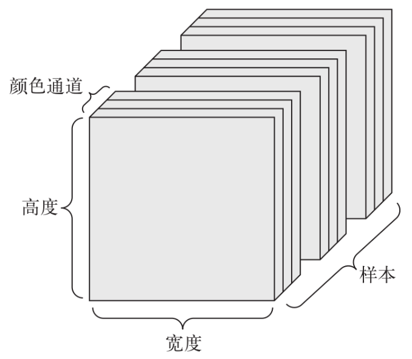

# TODO

- [ ] Mask R-CNN
- [ ] PSPNet (Pyramid Scene Parsing Network) 
- [ ] SegNet
- [ ] Attention U-Net
- [ ] HRNet (High-Resolution Network)
- [ ] Swin Transformer (Swin-Unet)
- [ ] ConvNeXT
- [ ] Transformer

# 卷积核

通过局部感受野学习局部特征，从而提取

> 步幅、填充 可以影响特征图的尺寸

# 池化层

特征图中选择最显著的特征，降低特征图的尺寸，减少计算量和参数数量，保留重要特征。

# 张量大小的理解

张量的属性：

- 轴数：Numpy中用ndim表示。例如：3D张量有3个轴
- 形状：Numpy中用shape表示。指张量沿着每个轴的维度大小（元素个数）
- 数据类型：Numpy中用dtype表示。指张量中包含数据的类型

一个4D张量的例子：128张彩色图片保存在(128,256,256,3)的张量中

 

> 当然不同框架的张量格式有所不同