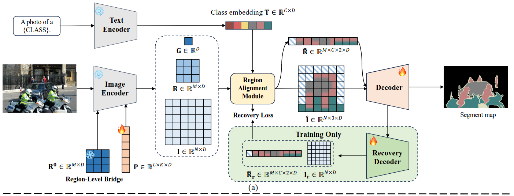

> 2024.11.27

> 标题：Exploring Regional Clues in CLIP for Zero-Shot Semantic Segmentation

> 任务：零样本语义分割

# TODO：非互斥损失

# 动机

### 先前工作的问题

- CLIP：在大规模图像-文本对上展现出强大的零样本图像识别能力，但在像素级的任务上，CLIP缺乏将==图像级别的理解转换为像素级别的理解的能力==
- 传统语义分割：只能处理训练集中出现的类别，==对于未见过的类别无能为力==
- 零样本学习：模型==倾向于识别训练过程中见过的类别==，导致对未见过类别的识别能力下降，存在过拟合的问题

### 创新点

- 区域级桥梁（RLB）和区域对齐模块（RAM）：==连接和对齐图像级和像素级的信息==，改善图像级到像素级转换的难题
- 恢复解码器与恢复损失（RDL）：有助于在模型训练过程中，==平衡任务特定知识和固有的泛化能力，减轻过拟合问题==

# 模型

  

### 工作流程 

1. 文本传入Text Encoder生成Class embedding
2. 图片、Region-Level Bridge、P(prompt提示词特征) 三者结合作为输入传入 Image Encoder，得到G特征、R特征、I特征。公式与流程图如下：
    

    

    

    

   > 从上到下 分别为：
   >
   > - G：视觉编码器的[CLS]标记特征，旨在捕获全局图像特征
   > - P：提示词特征
   > - I：加了位置标记的图像特征
   > - R：Region-Level Bridge特征，用G的权重初始化，作为图像级和像素级中间的桥梁
   >
   
   G、P、R的作用范围以及Mask：
   
   >  
3. G、R、I和Class embedding传入 区域对齐模块（RAM）得到 区域关系描述符 和 图片区域类别特征。公式与流程图如下： 

    

    

    

    
4. 通过Decoder得到最终分割图
5. 通过解码器得到的中间张量 传入Recovery Decoder，得到 恢复后的 区域关系描述符 和 图片区域类别特征，与RAM得到中间张量一起 计算损失。公式与流程图如下：

    

    

    

    

### 损失函数

 

# 实验

### 数据集

**PASCAL VOC 2012数据集**：

- 包含了20个类别的对象检测、图像分割和分类任务。包含了大约1万张图像。

  > 在这项研究中，作者从这20个类别中排除了背景类，并将其分为15个见过的类别和5个未见的类别，以评估模型在处理见过和未见类别时的性能。

**COCO-Stuff 164K数据集**：

- 扩展版本的COCO数据集，专注于材质和场景的分割。它包含了80个物体类别、91个材质类别，以及一个未标记类别，总共有164,000张图像。

  > 这项研究中，数据集被分为156个见过的类别和15个未见的类别。这个数据集的规模和复杂性使其成为评估零样本语义分割模型性能的一个重要基准。

**PASCAL Context数据集**：

- PASCAL VOC的一个扩展，它包含了59个前景类别和一个背景类别，总共有10,000多张图像。

  > 在这项研究中，数据集被分为50个见过的类别（包括背景）和10个未见的类别，用于评估模型在处理更复杂的场景和背景时的性能。

### 基线模型

1. **SPNet**：一种的语义分割网络，用于零样本语义分割任务。
2. **ZS3**：一种零样本语义分割方法，它通过利用类别之间的属性关系来提高分割性能。
3. **CaGNet**：一种上下文感知的网络，通过捕捉类别间的上下文关系来提高分割的准确性。
4. **SIGN**：一种结合了空间信息的生成网络，用于提高零样本语义分割的性能。
5. **Joint**：一种联合训练的方法，它同时考虑了图像的全局和局部特征。
6. **ZegFormer**：一种基于Transformer的零样本语义分割模型，通过解耦类别特征和空间特征来提高分割性能。
7. **ZSSeg**：一种零样本语义分割方法，通过使用预训练的视觉-语言模型来提高对未见类别的识别能力。
8. **DeOP**：一种开放词汇的语义分割方法，通过去耦类别特征和空间特征来提高分割性能。
9. **MaskCLIP+**：一种改进的零样本语义分割方法，它通过结合伪标签和自训练来提高性能。
10. **ZegCLIP**：一种结合了视觉提示调整和关系描述符的零样本语义分割方法，它通过一个阶段的推理过程来提高分割性能。

### 评估指标

1. **Mean Intersection-over-Union (mIoU)**：
   - ==语义分割任务中最常用的评估指标之一==，衡量预测分割图与真实标注之间的重叠程度。mIoU计算每个类别的Intersection-over-Union (IoU)值，然后取所有类别的均值。IoU值定义为预测分割区域与真实标注区域的交集面积除以它们的并集面积。
   - 在零样本语义分割中，mIoU特别重要，因为它可以分别评估模型对见过类别（mIoU(S)）和未见类别（mIoU(U)）的分割性能。
2. **Pixel-wise Classification Accuracy (pAcc)**：
   - pAcc衡量的是模型对图像中每个像素分类的准确率。计算所有像素中被正确分类的比例。
3. **Harmonic Mean IoU (hIoU)**：
   - 一种平衡指标，用于==衡量模型在见过类别和未见类别上的性能==,特别适用于零样本学习场景。它是mIoU(S)和mIoU(U)的调和平均值，计算公式如下： 
      

### 实验设置

1. **归纳设置（Inductive Setting）**：在这种设置下，模型在训练时只能看到见过的类别，对测试时遇到的未见类别一无所知。
2. **传导设置（Transductive Setting）**：这种设置中，模型在测试时知道未见类别的名称，尽管训练时没有这些类别的标签。

### 具体实验

- 指标分析

 

 

 

- 画面分析

 

### 消融实验

 

组件：

- 区域级桥梁（RLB）
- 区域对齐模块（RAM）
- 恢复解码器与恢复损失（RDL）
- RLB的token数量
- [CLS]token与RLB的融合
- 不同损失函数和恢复损失的层数

# 结论

