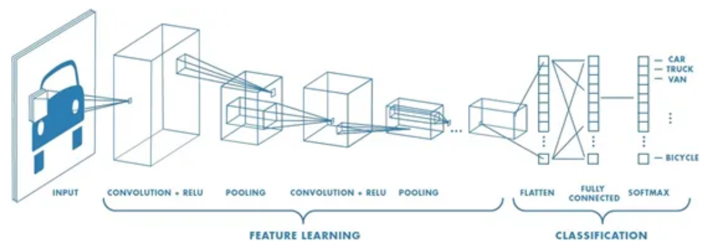
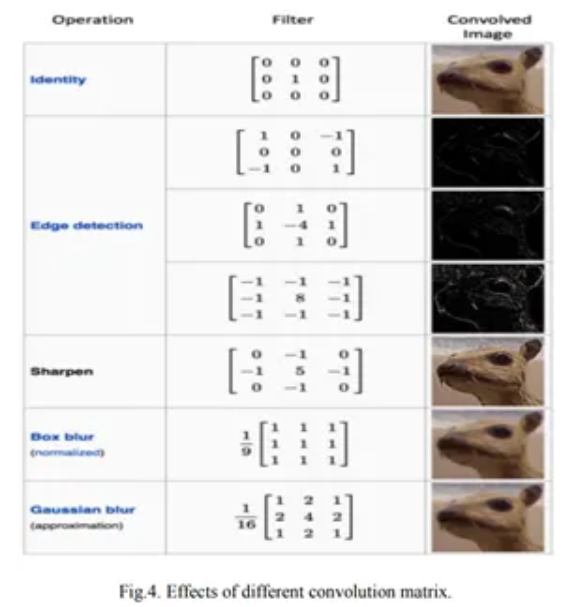

> 2024.11.5

> 标题：Convolution Neural Network

# 模型

 

> CNN相比于传统全连接层(深度神经网络DNN)强在哪？
>
> 减少非常多的参数，大幅降低运算时间

> ==CNN中3x3卷积核只需要训练9个参数，而DNN中需要训练的神经元的数量和图片的像素点一样多==

> 原因？
>
> CNN看到一张图片的局部信息，而不像DNN把照片全部信息丢进去训练

模型结构：

### 卷积层：主要目的 提取特征

就如图像处理中的filter：将图像的亮度乘上一个矩阵，得到不同信息的图片

在CNN中，filter里的矩阵是机器学习里learning出来的

 

好处：针对不同的问题，卷积层的参数随着training自动调整，我们就不需要自己去设计filter了

> 步幅：指示卷积核如何移动
>
> 填充：卷积完，图像会变小，损失边缘信息，填充防止

### 非线性层

就是激活函数

### 池化层

主要目的 增加感受野、压缩输入 加快神经网络运算速度	

用于下采样

> 两种方式：
>
> 1. 最大池化
> 2. 平均池化

为什么需要池化层？

特征不变性：汇聚操作更关注是否存在某些特征而不是特征具体的位置

> 通过池化层，特征在输出中被保留

### 全连接层

将前面提取出来的特征，丢进去训练