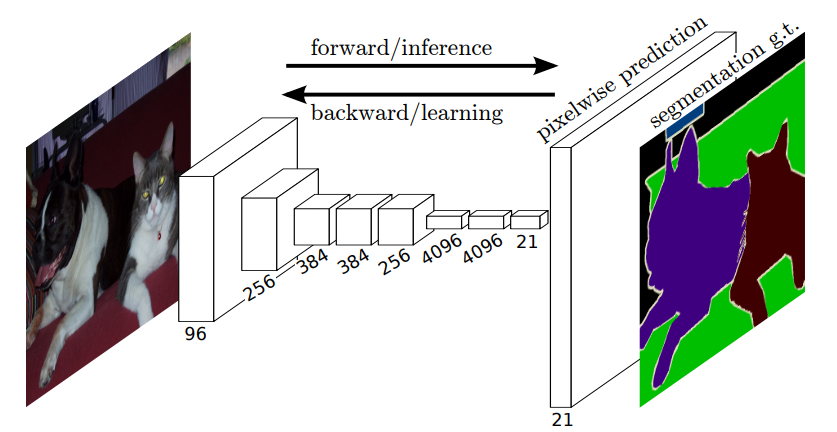
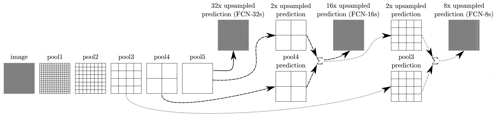

> 2024.11.4

> 标题：Fully Convolutional Networks for Semantic Segmentation

> 任务：语义分割
>

# 核心思想

1. 无连接层的全卷积网络，适应任意尺寸的输入
2. 反卷积上采样扩大图像尺寸
3. 跳跃连接结构（融合），提升鲁棒性和精确性

# 模型

  

---

 

工作流程：

1. 对原图进行 conv1、pool1 后图像缩小为原图的 1/2。

2. 进行 conv2、pool2，图像缩小为原图的 1/4。
3. 进行 conv3、pool3，图像缩小为原图的 1/8，此时保留 pool3 的输出结果（特征图）。
4. 进行conv4、pool4，图像缩小为原图的 1/16，此时保留 pool4 的输出结果（特征图）。
5. 进行 conv5、pool5，图像缩小为原图的 1/32。
6. 进行将原全连接层变成卷积操作的 conv6、conv7，输出的特征图大小仍为原图的 1/32。

● FCN-32s
       直接将conv7之后只有原图1/32大小的特征图进行32倍上采样恢复到原图大小，然后进行预测。

● FCN-16s
       先将conv7之后只有原图1/32大小的特征图进行2倍上采样，此时特征图为原图的1/16；然后和pool4的输出（也是原图大小的1/16）进行融合；最后将融合后的特征图进行16倍上采样恢复到原图大小，再进行预测。
● FCN-8s
       先将conv7之后只有原图1/32大小的特征图进行4倍上采样，此时特征图为原图的1/8；然后将pool4输出的特征图进行2倍上采样得到原图1/8大小的特征图；接着将前两个处理之后的特征图和pool3的输出（也是原图大小的1/8）进行融合；最后将融合后的特征图进行8倍上采样恢复到原图大小，再进行预测。