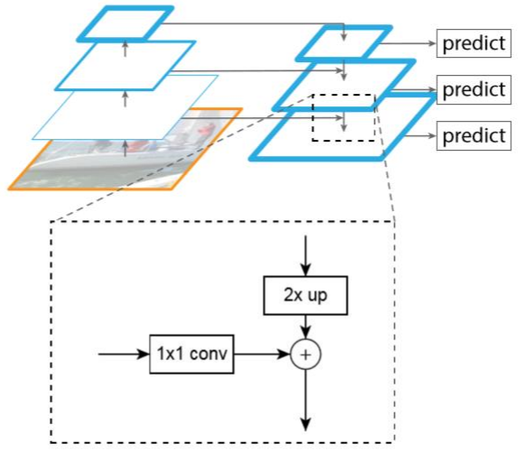

> 2024.11.7

> 标题：Feature Pyramid Networks for Object Detection

> 任务：小目标检测
>

# 模型

 

> 低层的特征具有高分辨率、语义信息较弱的特点、含小目标的信息多
>
> 高层的特征具有低分辨率、语义信息较强的特点、含有小目标的信息少

此模型将低层特征与高层特征融合，综合考虑分辨率与语义信息

融合方式为虚线方框中所展示的：将左侧部分经过一个1x1的卷积核，右侧部分2倍上采样，然后拼接

# 为什么矩阵相加可以融合不同特征信息？

（猜想）来自不同源的光波、声波叠加时，我们仍能将其分离。

图像也是一种信息，可以在叠加的时候保持自己的特征