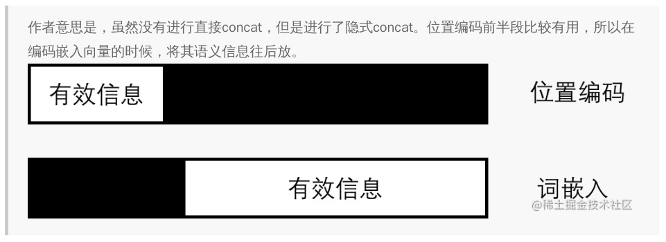

> 2024.11.29

> 标题：Attention Is All You Need

https://zhuanlan.zhihu.com/p/410258597

https://www.cvmart.net/community/detail/4032

# Self-Attention

 

作用：输入序列中的每一个元素对其他元素的关注程度

> 例如：
>
> 输入序列为x^1^，x^2^，x^3^；输出为b^1^
>
> b^1^考虑了整个输入的信息

# Multi-Head Self-Attention

 

作用：每个注意力头都可以让模型学习到不同的行为，最后将不同行为作为知识组合起来

# Positional Encoding

self attention本身是没有位置信息的，例如：“a打b” 和 “b打a” 的效果是一样的。因此

作用：考虑输入序列中不同位置信息的重要程度

 

### 为什么是相加操作而不是拼接操作

 

另一种理解的图：

 
