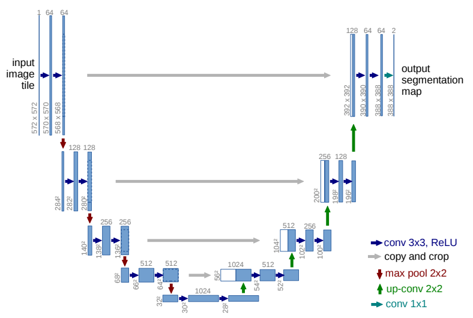

> 2024.11.4

> 标题：U-Net: Convolutional Networks for Biomedical Image Segmentation

# 任务

医学图像分割

# 核心思想

浅层特征更local视角，深层特征更global视角。

> 问题：浅层抓到的特征，随着经过下层的卷积层而丢失
>
> 我们希望：既有local视角，又有global视角

方法：将浅层特征和深层特征串接

> 因此，我们的模型能抓到local和global的特征
>
> 例如：细胞核的边界和形态这种非常local的特征

# 模型

 

> U的左半边，理解为Encoder；U的右半部，理解为Decoder。