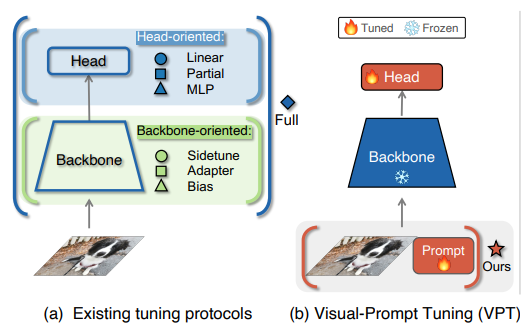
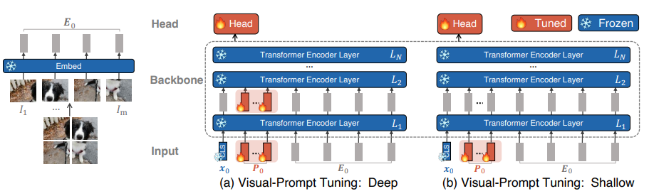
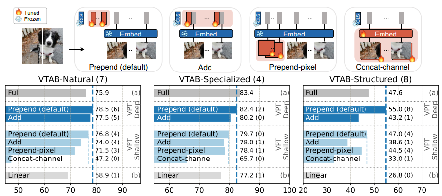

> 2024.11.29

> 标题：Visual Prompt Tuning

# 作用

用于transformer模型 的小样本学习 的微调

# 先前工作存在的问题

transformer模型的参数量大，微调代价昂贵

# 模型

### 与传统微调方法的对比

 

（a）图所展示的微调方法：

- 全微调
- 只微调Head
- 只微调Backbone

（b）图展示的微调方法：

- 只增加少量的 特定于任务的可学习参数 到输入空间（不到整个模型参数的百分之1，冻结Backbone，微调期间Prompt和Head一起学习）

### 两种策略

 

> 实验结果是Deep比Shallow好

### 提示词位置的影响

 

结论：Prepend的效果更好