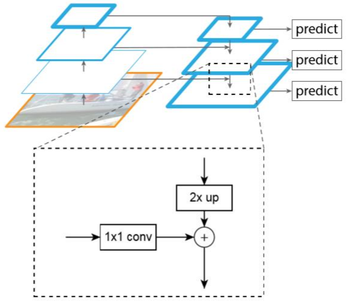

> 2024.11.7

> 标题：Feature Pyramid Networks for Object Detection

# 任务

目标检测

语义分割（？）

# 模型

 

> 低层的特征具有高分辨率、语义信息较弱的特点、
>
> 高层的特征具有低分辨率、语义信息较强的特点

此模型将低层特征与高层特征融合，综合考虑分辨率与语义信息

融合方式为虚线方框中所展示的：将左侧部分经过一个1x1的卷积核，右侧部分2倍上采样，然后拼接