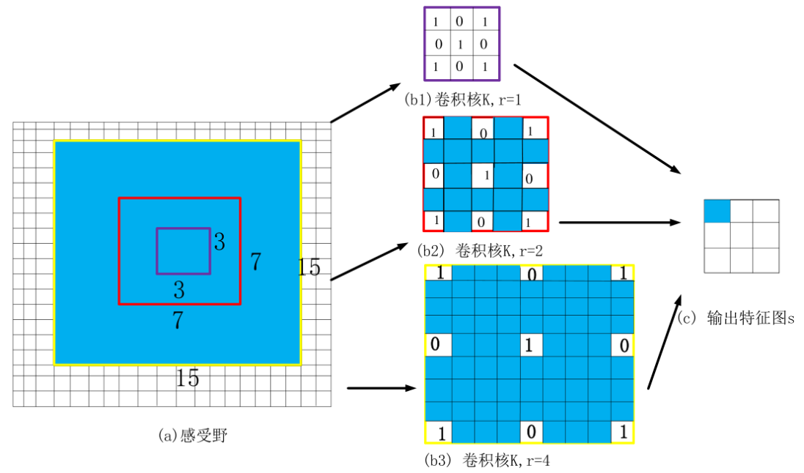
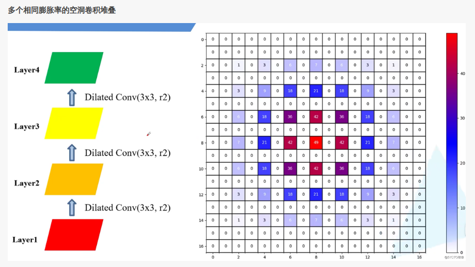
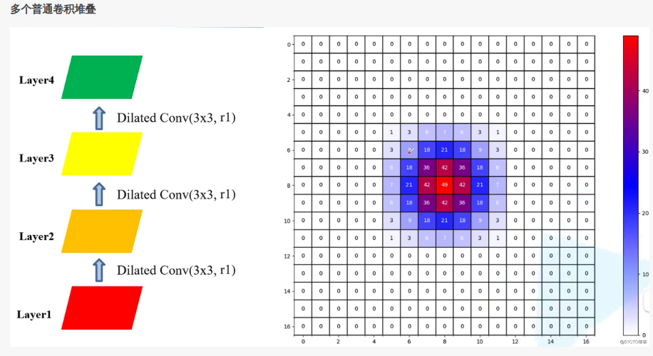
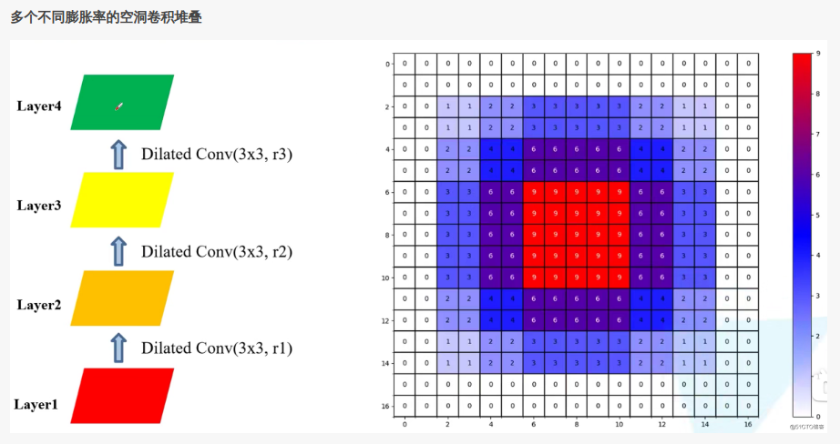

> 2024.11.5

> 标题：MULTI-SCALE CONTEXT AGGREGATION BY DILATED CONVOLUTIONS

问题：

- 池化层使得图片细节丢失
- 但是没有池化层 感受野就会小很多

# 方法

 

空洞卷积：就是在卷积核中添加0

主要作用：

- 增加感受野，获取更大范围的信息

> 感受野：一个像素对应输入的区域范围，感受野越大，包含的信息越多

# 问题

棋盘效应：

 

右图所示：有些像素是没有参数运算的

 

感受野小了很多

# 解决方法

 